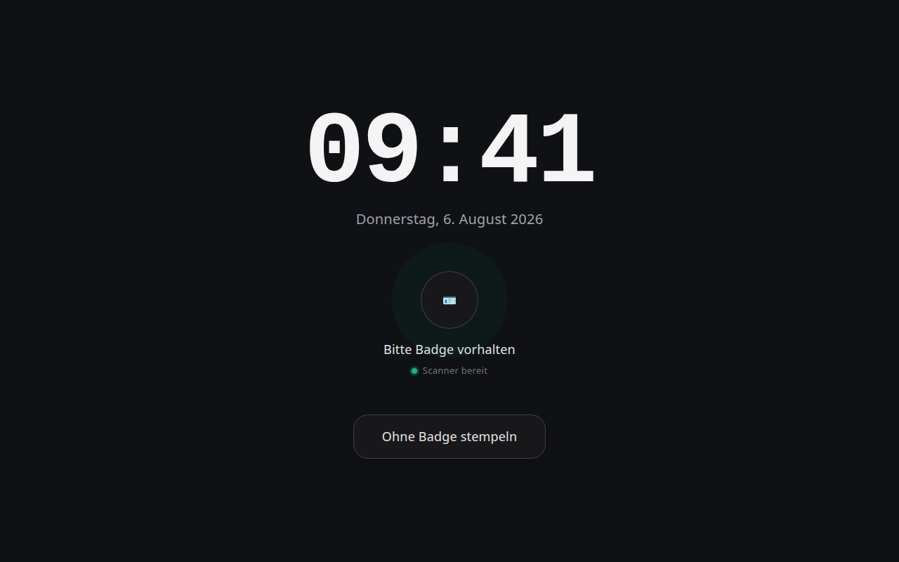
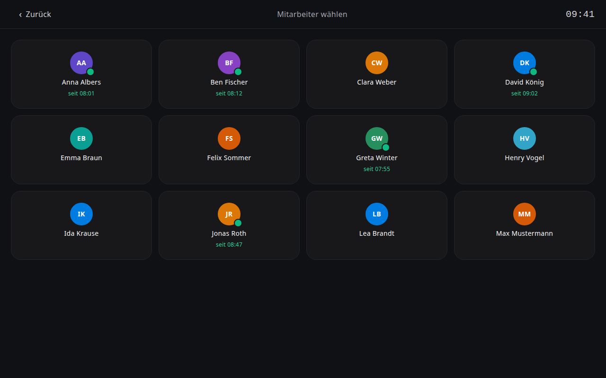
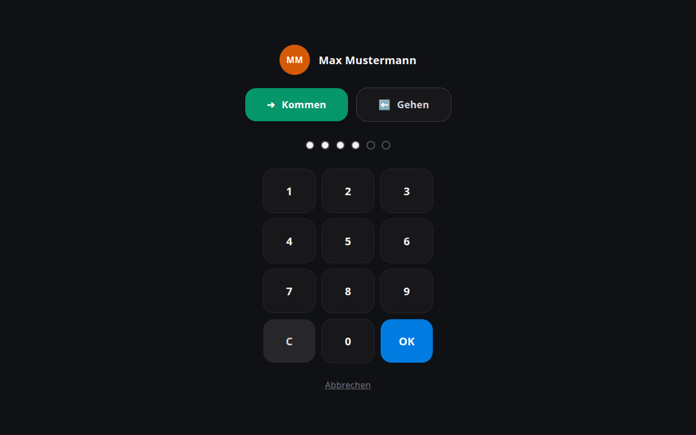
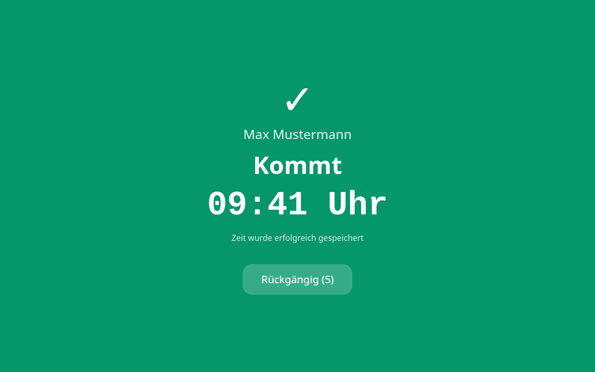

# Timeclock

**Kiosk time & attendance terminal for Frappe HR** — turn any tablet (or any device with a browser) into a wall-mounted punch clock. Employees clock in and out via a touch grid + PIN or by holding their QR badge to the camera. Every punch lands as a standard **Employee Checkin**, so HRMS Auto Attendance, timesheets and payroll work out of the box.

No proprietary hardware, no forked doctypes — a small app on top of plain Frappe HR.

## Screenshots

*All names shown are fictional demo data.*

| Idle — clock & badge scan | Employee grid (PIN path) |
| --- | --- |
|  |  |

| PIN entry | Confirmation with undo |
| --- | --- |
|  |  |

## Features

**Kiosk (`/kiosk`)**
- **Clock-first idle screen** in a dark terminal look: big clock + date (synced to the **server clock**, so the display always matches the recorded punch time — even on a misconfigured tablet), badge prompt, one tap to the employee grid
- Employee grid with **initials avatars and live presence** (green dot + "seit HH:MM" while clocked in) → **Kommen/Gehen** (pre-selected from the last punch) → touch PIN pad; falls back to the clock after 45 s of inactivity
- **QR badge scanning** with the device camera — active on the idle screen and the grid; hybrid: the PIN path always stays available
- Direction is toggled automatically on badge scans, with a **5-second undo**
- **Privacy by default:** the camera scans without showing its image (a badge icon + "scanner ready" pulse instead); a live preview can be enabled in settings. If the camera cannot start, the kiosk says so loudly and falls back to PIN
- Confirmation **sounds** (rising two-tone for IN, falling for OUT), toggleable
- Works on any webcam/browser for testing — camera access requires a secure context (HTTPS or `localhost`)

**Admin (Desk)**
- Own **app tile** in the launcher + **Timeclock workspace**, visible only to System Managers / HR Managers
- Dashboard: **who's-in board** (name, in since, device), number cards (*present now, punches today, missing check-outs, absent today*) and a working-hours chart
- **Time Clock tab on the Employee form:** enable flag, PIN (encrypted at rest, validated server-side), badge ID, inline **QR preview** and **badge printing** (86×54 mm card print format with server-rendered QR)
- **Generate Badge** re-issues a random UUID — a lost card stops working immediately
- `Timeclock Settings` single: camera preview, sounds, kiosk language (German/English)

**Integration & security**
- Punches are standard **Employee Checkin** records (`log_type`, `time`, `device_id`) — HRMS **Auto Attendance** turns them into Attendance + working hours
- An hourly task keeps `Shift Type.last_sync_of_checkin` current, so realtime kiosk punches are actually processed (normally only biometric sync tools advance that field)
- PIN comparison is constant-time and server-side, with per-employee lockout after 5 failed attempts; unknown badges are rate-limited per device
- Badges are random 128-bit UUIDs, never the employee number
- The kiosk runs under a dedicated user with the **Timeclock Kiosk** role — no desk access, no employee data beyond the grid

## Requirements

- Frappe Framework + [Frappe HR (hrms)](https://github.com/frappe/hrms)

## Installation

```bash
cd $PATH_TO_YOUR_BENCH
bench get-app $URL_OF_THIS_REPO
bench --site yoursite install-app timeclock
bench --site yoursite migrate
```

The built kiosk frontend ships with the repo — no Node step is needed for installation. If you develop on the frontend, rebuild before committing:

```bash
cd apps/timeclock/frontend
npm install
npm run build
```

## Setup

1. **Enable employees:** Employee form → *Time Clock* tab → check *Time Clock Enabled*, set a PIN. For QR: *Generate Badge*, then *Print Badge* (or let employees scan the on-screen QR).
2. **Create the kiosk user** — the shared login for the kiosk device(s):
   - Desk → *New User* → email e.g. `kiosk@yourcompany.com`, user type **Website User** (no desk access), disable the welcome email and set a password
   - assign exactly one role: **Timeclock Kiosk** (created by the app) — it gates the kiosk API and nothing else; the user cannot read employee data beyond the kiosk grid
   - log in once on the kiosk device and open `/kiosk` — the session is long-lived, one kiosk user can serve any number of terminals (tell them apart via the `?device=` parameter)
   - **or skip manual logins entirely with device auto-login:** in *Timeclock Settings* set *Kiosk Auto-Login User* + a *Kiosk Auto-Login Token* (min. 20 chars), then use `/kiosk?device=front-door-1&token=<token>` as the kiosk start URL. Devices heal themselves after reboots and session expiry; regenerating the token locks all devices out instantly. Auto-login refuses any account that has System Manager or lacks the Timeclock Kiosk role
3. **Auto Attendance (once):** create a `Shift Type` with *Enable Auto Attendance* (working hours from *First Check-in and Last Check-out*, direction *Strictly based on Log Type*) and assign it to your employees — without a shift, checkins are recorded but no Attendance is created.
4. **Open the kiosk:** log in as the kiosk user and open `https://yoursite/kiosk?device=front-door-1`. The `device` parameter is recorded on every punch and shown on the who's-in board.

### Android tablet (kiosk mode)

Any Android 8+ tablet works. A proven setup — **step-by-step guide incl. all traps: [docs/freekiosk-setup.md](docs/freekiosk-setup.md)**:

#### Tested devices

| Device | Notes |
| --- | --- |
| Desktop browser + webcam | Chrome/Chromium with any standard webcam — handy for development and evaluation (camera needs `localhost` or HTTPS) |
| Samsung Galaxy Tab A11+ (SM-X230, 11″) | ✅ **Verified in production** — wall-mounted with FreeKiosk in Device Owner mode; the front camera reads the 40 mm badge QR in well under a second. 3D-printable wall mount: [MakerWorld — Wall Mount Samsung Tab A11](https://makerworld.com/en/models/2973635-wall-mount-samsung-tab-a11?from=search#profileId-3335232) |

- [FreeKiosk](https://github.com/RushB-fr/freekiosk) (MIT) as the lockdown shell: WebView mode with the kiosk URL (ideally the auto-login URL incl. `&token=`, so nobody ever types credentials on the device), Device Owner via `adb shell dpm set-device-owner`, boot autostart, admin PIN. Note: FreeKiosk's built-in "Website Authentication" only answers HTTP Basic Auth challenges — it cannot fill the Frappe login form; use the token auto-login instead
- Camera scanning needs a **secure context** — serve the site via HTTPS (or allow the origin explicitly in the shell)
- Enable the vendor's **battery protection / charge limit** — the tablet is plugged in 24/7
- Allow media autoplay in the WebView if you want confirmation sounds without a prior touch

## Development

```bash
# backend: standard bench workflow
bench --site yoursite migrate

# frontend dev server (proxies to your bench)
cd apps/timeclock/frontend
npm run dev
```

Python code is formatted with `ruff` (tabs, line length 110, Frappe conventions). Backend tests: `bench --site yoursite run-tests --app timeclock`. CI (GitHub Actions) runs lint, the frontend build and the server tests against Frappe v16 + HRMS.

The kiosk UI ships in German and English — switch via *Timeclock Settings → Kiosk Language*. Backend error messages follow the kiosk user's language (German translations included).

## Roadmap

- Wallet passes (Apple/Google) carrying the badge QR
- Offline queue (service worker; punches sync with their original timestamp)
- Reduced badge-management view for supervisors without full HR permissions

## License

[GPL-3.0](license.txt)
